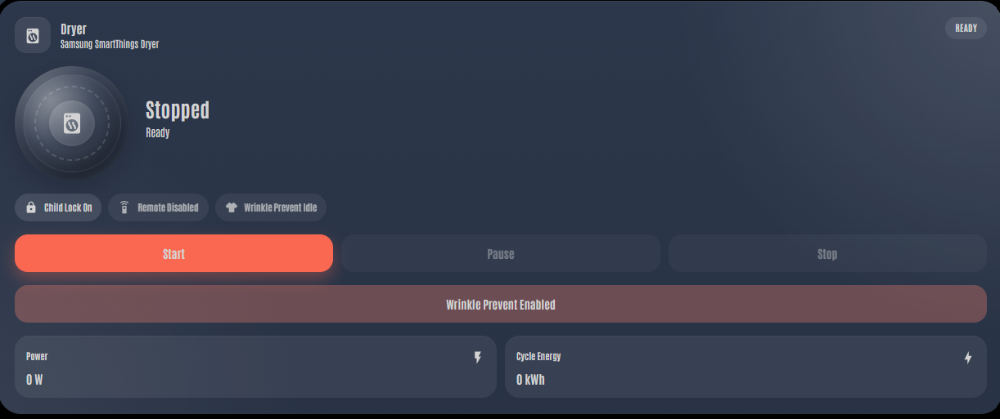
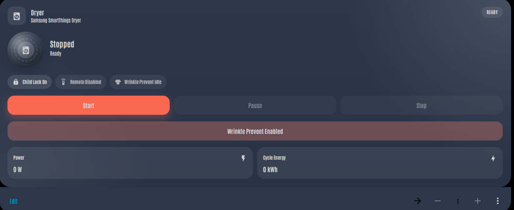

# Samsung HA Dryer Card

A custom Lovelace card for Samsung dryers using the Home Assistant SmartThings integration.

---

## 📸 Preview




---

## ✨ Features

- Hero and Compact layouts
- Native Home Assistant config editor
- Start / Pause / Stop controls
- Wrinkle Prevent toggle
- Status chips (Child Lock, Remote, Wrinkle Prevent)
- Power + energy metrics
- Smart state handling (disabled buttons, dynamic labels)
- Washer-style UI with animated drum

---

## 📦 Installation

### HACS (Recommended)

1. Open HACS
2. Click **⋮ → Custom repositories**
3. Add this repo
4. Category: **Dashboard**
5. Install

Then add the resource:

```yaml
url: /hacsfiles/samsung-ha-dryer-card/samsung-ha-dryer-card.js
type: module